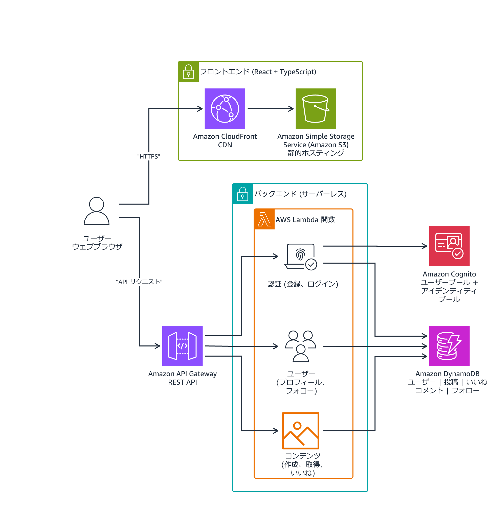

<!--include:Logo-->

# ラボ 2: Kiro による拡張と自動化

<!--include:Header-->

## ラボの概要

このハンズオンラボでは、Kiro を使用して、構築済みのマイクロブログアプリケーションの開発ワークフローを拡張および自動化します。ラボを開始した時点で、アプリケーション (React フロントエンド + サーバーレスバックエンド) が既にデプロイされ実行されています。Kiro が外部ツールに接続する仕組みを理解するために、MCP サーバーを手動で設定します。その後、Kiro パワーをインストールし、それを使って実行中のアプリケーションに新しいフロントエンド機能を追加します。エージェントフックとカスタムサブエージェントを使用してオートメーションレイヤーを構築します。最後に、チームコラボレーション用の `.kiro/` ディレクトリを整理し、Git にコミットします。

このラボを修了すると、実行中のアプリケーションの機能を拡張し、チームオンボーディング用のプロジェクトを設定して、Kiro の拡張機能に関する実践的な経験を積むことができます。

:::alert このラボでは、AWS ビルダー ID から約 20 Kiro クレジットを消費します。実際の使用量は、Kiro とのやり取りの仕方によって異なります。開始する前に、アカウントに十分なクレジットがあることを確認してください。
:::

### 目標

このラボを修了すると、以下のことができるようになります。

- MCP サーバーを手動で設定し、接続を確認する。
- チャットで MCP ツールを使用して、外部のドキュメントやサービスをクエリする。
- MCP ログを見つけて解釈し、トラブルシューティングを行う。
- IDE から Kiro パワーをインストールし、それを使用してデプロイ済みアプリケーションにフロントエンド機能を追加する。
- ファイル保存時のコードコメントを自動化するエージェントフックを作成する。
- 範囲を限定したツール権限と対象を絞ったシステムプロンプトを定義したカスタムサブエージェントを作成する。
- **.kiro/** ディレクトリをチームオンボーディング用に整理して、Git にコミットする。


<!--include:StartLabNoSS-->


### マイクロブログアプリケーションのアーキテクチャ

次の図は、事前にデプロイされたマイクロブログアプリケーションのアーキテクチャを示しています。



**画像の説明: マイクロブログアプリケーションのアーキテクチャを示す図。ユーザーは CloudFront と S3 経由で React フロントエンドにアクセスします。API リクエストは API Gateway を経由して Lambda 関数 (認証、ユーザー、コンテンツ) に送信され、そこから DynamoDB テーブルへのアクセスや Amazon Cognito による認証が行われます。**

アプリケーションの主なリソースは以下のとおりです。

- Amazon S3 でホストされ、Amazon CloudFront 経由で提供される **React フロントエンド**
- リクエストを Lambda 関数にルーティングする **Amazon API Gateway** REST API
- ドメイン別に整理された **AWS Lambda 関数** (認証 (登録、ログイン)、ユーザー (プロフィール、フォロー)、コンテンツ (作成、取得、いいね))
- ユーザー、投稿、いいね、コメント、フォローを格納する **Amazon DynamoDB** テーブル
- 認証と認可のための **Amazon Cognito** ユーザープールとアイデンティティプール


### ラボ操作の注意点

このラボで使用する AWS サービスの機能は、ラボで必要なものに限定されています。このラボガイドで指定されていないサービスを使用したりアクションを実行したりすると、エラーが発生することがあります。

---

## タスク 1: ラボ環境に接続する

このタスクでは、ラボ環境に接続し、プリインストールされているツールとアプリケーションのソースコードを確認します。

### タスク 1.1: Kiro IDE デスクトップに接続する

1. myClass にサインインして、ラボ一覧のページを表示します。

1. ラボ 2 のパネルで  [**起動**] をクリックしてラボ 2 のページを表示します。

1. ラボ 2 のページの左側にある [**ラボの情報**] パネルから [**LabInstanceURL**] の値をコピーします。

1. この URL を新しいブラウザタブに貼り付けます。

   <i aria-hidden="true" class="fas fa-sticky-note" style="color:#563377"></i> **注:** 接続は公的に信頼された TLS 証明書を使用して Amazon CloudFront を介して提供されるため、ブラウザはセキュリティ警告なしで直接接続します。

1. DCV ログイン画面で、認証情報を入力します。

   - **ユーザー名**: LabInstanceURL の出力を参照します (完全な URL を使用した場合は事前に入力されています)。
   - **パスワード**: ラボパネルから [**LabPassword**] の値をコピーします。

1. デスクトップが読み込まれるまで待ちます。Kiro IDE はデスクトップのショートカットとして使用できます。

   <i aria-hidden="true" class="far fa-comment" style="color:#008296"></i> **考察:** 表示領域を最大化するには、ブラウザウィンドウ上部の DCV ツールバーを使用して全画面表示を切り替えます。全画面表示を終了するには、**ESC** キーを押すか、同じツールバーコントロールを使用します。

1. ノートパソコンと Windows デスクトップ間でクリップボードの同期を有​​効にします。

   このラボでは、これらの手順、ノートパソコン、Windows デスクトップ間でコマンドをコピーしてペーストします。ブラウザでクリップボードを共有できるようにするには、次の操作を行います。

   - 「...クリップボードにコピーされたテキストと画像を確認しようとしています」というメッセージが表示されたら、[**Allow**] を選択します。DCV セッションが、**クリップボードが同期されました**というプロンプトを表示します。
   - そのプロンプトが自動的に表示されない場合:

      - DCV セッションの上部で、クリップボード (2 つの四角形) アイコンをクリックします。

         これでプロンプトが表示されるはずです。[**Allow**] をクリックします。

      - DCV セッションが、**クリップボードが同期されました**というプロンプトを表示します。

      - [**完了**] をクリックします。

   <i aria-hidden="true" class="fas fa-sticky-note" style="color:#563377"></i> **注:** 一度権限を付与すると、ブラウザはセッションの間ずっとその権限を記憶します。ブラウザのタブを閉じたり更新したりしない限り、この手順を繰り返す必要はありません。

1. DCV セッションを初めて使用する前に、貼り付け機能の使い方を確認します。

   - **Windows** マシンからこのラボに接続する場合は、**Ctrl+V** を使用してテキストを貼り付けます。
   - **MacOS** マシンからこのラボに接続する場合は、**Command+V** ではなく、**Control+V** (実際の Control キー) を使用します。
   - 使用しているマシンの種類に関係なく、DCV セッションで貼り付けたい場所を右クリックしてコンテキストメニューを開き、[**貼り付け**] または [**テキストとして貼り付け**] を選択することもできます。

1. デスクトップのショートカットから **Kiro** を開きます。

### タスク 1.2: AWS ビルダー ID を使用してサインインする

1. Kiro で [**Sign in**] をクリックします。

   ブラウザのタブが開き、サインインまたはサインアップの方法を選択できます。

   <i aria-hidden="true" class="fas fa-sticky-note" style="color:#563377"></i> **注:** サインインで 400 エラーが表示される場合は、ブラウザタブを閉じて Kiro から改めてサインインします。

1. [**AWS Builder ID**] を選択します。

1. ラボ 1 で使用したのと同じ AWS ビルダー ID でサインインします。

- AWS ビルダー ID アカウントに既に関連付けられている E メールアドレスを入力します。

- <span style="ssb_orange_oval">Continue</span> をクリックします。

- [**Enter your password**] ページでパスワードを入力します。

- <span style="ssb_orange_oval">Continue</span> をクリックします。

- 認証コードの入力を求められます。送信された E メールに記載されているコードを確認します。E メールの受信には 1～2 分かかることがあります。

- 認証コードを貼り付けて、<span style="ssb_orange_oval">Continue</span> をクリックします。

- パスワードを保存するように求められたら、[**Not now**] を選択します。

- Kiro IDE がデータにアクセスすることを許可するよう求められたら、<span style="ssb_orange_oval">Allow access</span> を選択します。

- ブラウザに “You can close this window” (ウィンドウを閉じることができます) というメッセージが表示されます。 ブラウザを終了します。

   <i aria-hidden="true" class="fas fa-sticky-note" style="color:#563377"></i> **注:** ラボ 1 で新しい AWS ビルダー ID を作成した場合は、ここでも同じアカウントを使用してください。Kiro クレジットがラボ間で引き継がれます。

### タスク 1.3: Kiro の設定を行う

1. **Kiro** アプリケーションに戻ります。

   [**Import configuration**] ページが表示されます。

1. [**Next**] をクリックします。

1. お好みのテーマ (Kiro Dark または Kiro Light) を選択し、[**Continue**] をクリックします。

1. [**Set up shell**] 画面で、[**Done**] をクリックします。

   `C:\Users\student\environment` フォルダについて、"Do you trust the authors of the files in this folder?" (このフォルダ内のファイルの作成者を信頼しますか) というメッセージが表示されたポップアップウィンドウが開きます。

1. [**Trust the authors of all files in the parent folder 'student'**] の横にあるチェックボックスをオンにして、[**Yes, I trust the authors**] を選択します。

   [**Let's build**] 画面が表示されます。

   表示される通知は自動的に閉じますので、しばらくお待ちください。現時点では対応する必要はありません。

   <i aria-hidden="true" class="fas fa-sticky-note" style="color:#563377"></i> **注:** デフォルトシェルの設定を求められたら、[**Command Prompt**] を選択して続行します。

1. Kiro の画面左下にある歯車のアイコンをクリックして [**Restart to Update (1)**] をクリックして、Kiro のバージョンを更新します。

1. Kiro が再起動するまで待ちます。

1. Kiro のサイドバーの下部にあるチェックマーク付きの人物アイコンをクリックして、サインインしていることを確認します。このラボを実施するのに十分なクレジットがあることを確認します。

1. IDE のデフォルトターミナルをコマンドプロンプトに設定します。

   - IDE の左下隅にある <i aria-hidden="true" class="fa fa-cog"></i> **Manage** (歯車) アイコンをクリックし、[**Settings**] を選択します。

   - [**Search settings**] テキストボックスで `default terminal Windows` を検索します。

   - ドロップダウンメニューで、[**Terminal] > [Integrated] > [Default Profile: Windows**] を [**Command Prompt**] に設定します。

      <i aria-hidden="true" class="fas fa-sticky-note" style="color:#563377"></i> **注:** これにより、Kiro はこのラボの後半でターミナルで実行されるコマンドの結果を読み取ることができます。

   - [**Settings**] タブを閉じます。

<i aria-hidden="true" class="far fa-thumbs-up" style="color:#008296"></i> **タスク完了:** ラボ環境に接続して、AWS ビルダー ID でサインインし、Kiro を設定できました。

---

## タスク2: マイクロブログアプリケーションを確認する

このタスクでは、事前にデプロイされたマイクロブログアプリケーションを調べ、開発ツールが利用可能であることを確認します。

### タスク2.1: プロジェクトの構造を調べてツールを確認する

1. 左側の EXPLORER パネル (**ENVIRONMENT** というラベルが付いたもの) で、マイクロブログアプリケーションのプロジェクト構造が表示されていることを確認します。以下のフォルダとファイルが表示されます。
   - `backend/`: Lambda 関数 (Node.js/JavaScript)
   - `frontend/`: React + TypeScript フロントエンドのソースコード (CDK 経由で S3 + CloudFront にデプロイ)
   - `infrastructure/`: Lambda、API Gateway、DynamoDB、Cognito、S3、CloudFront リソースを定義する CDK スタック
   - `deploy-backend.ps1`: ビルド、パッケージ、CDK デプロイを処理する PowerShell デプロイスクリプト
   - `deploy-frontend.ps1`: フロントエンドを構築して、S3 にアップロードし、CloudFront を無効にするための PowerShell スクリプト
   - `deploy-backend.sh`: シェルデプロイスクリプト (Linux と同等のもの)
   - `DESIGN_LANGUAGE.md`: アプリケーションの設計システムドキュメント

1. Kiro でターミナルを開き ([**View**] > [**Terminal**] の順に選択)、ツールが使用可能であることを確認します。

   ```bash
   node --version
   npm --version
   aws --version
   ```

   <i aria-hidden="true" class="fas fa-sticky-note" style="color:#563377"></i> **注:** 3 つのコマンドはすべてバージョン番号を返すはずです。いずれかのコマンドが失敗した場合は、担当インストラクターに伝えてください。

### タスク 2.2: 実行中のアプリケーションを確認する

1. ラボ 2 のページが表示されているブラウザのタブに戻り [**コンソールを開く**] を選択して AWS マネジメントコンソールを新しいタブで開きます。

1. [**CloudFormation**] に移動し、[**AppStack**] スタックを選択します。

1. [**出力**] タブをクリックして、[**CloudFrontDomainName**] の値 (`https://` で始まる URL) を探します。

1. URL をコピーして、新しいブラウザタブで開きます。

1. マイクロブログアプリケーションのログインページが読み込まれるはずです。

   <i aria-hidden="true" class="fas fa-sticky-note" style="color:#563377"></i> **注:** 空白の画面またはエラーがページに表示される場合は、1～2 分待ってから更新してください。CloudFront ディストリビューションは、初回デプロイから反映されるまで少し時間がかかる場合があります。

### タスク 2.3: 新規アカウントを登録する

1. ログインページで、[**Register**] をクリックして新規アカウントを作成します。

1. [**Create an Account**] ページで、以下の情報を入力します。

   - **ユーザー名:** `labuser`
   - **E メール**: `labuser@example.com`
   - **表示名**: `Lab User`
   - **パスワード**: ラボ 2 のページの左側にある [**ラボの情報**] パネルから [**AppPassword**] の値をコピーします。
   - **パスワードの確認**: 同じ [**AppPassword**] の値を貼り付けます。

1. [**Register**] をクリックします。

1. 登録が完了すると、アプリケーションフィードにリダイレクトされます。メインフィードページが表示されることを確認します。

   <i aria-hidden="true" class="fas fa-sticky-note" style="color:#563377"></i> **注:** ユーザー名、E メール、表示名の各フィールドには任意の値を使用できます。上記のサンプル値は、便宜上提供されているものです。Cognito のメール認証は有効になっていますが、このラボでは必須ではないため、実際のメールアドレスを使用する必要はありません。

### タスク 2.4: テスト投稿を作成する

1. ナビゲーションバーで [**New Post**] をクリックします。

1. 最初の投稿となるコンテンツ (例:「マイクロブログアプリからこんにちは。 初めての投稿です」) を入力して、送信します。

   投稿が作成されると、フィードにリダイレクトされます。

1. 内容の異なる投稿を 2～3 件追加して、フィードに入力します。以下に例を挙げます。
   - 「今日は Kiro の拡張機能を試しています」
   - 「初めて MCP サーバーを設定しました」

1. すべての投稿が、正しい表示名とタイムスタンプとともにフィードに表示されていることを確認します。

   <i aria-hidden="true" class="far fa-comment" style="color:#008296"></i> **考察:** これらの投稿は、後ほどタスク 4 で追加した新機能をテストする際に役立ちます。既存の投稿を残しておくことで、変更を加えた後にアプリケーションが正しく動作しているかを確認できます。

<i aria-hidden="true" class="far fa-thumbs-up" style="color:#008296"></i> **タスク完了:** マイクロブログアプリケーションの構造を調べ、開発ツールを検証し、アプリケーションが実行されていることを確認したほか、新規アカウントを登録してテスト投稿を作成しました。

---

## タスク 3: MCP サーバの設定と使用

このタスクでは、Kiro が外部ツールに接続する仕組みを理解できるよう、MCP サーバーを手動で設定します。この手動によるアプローチは、タスク 4 で行うパワーベースのアプローチとは対照的です。

:::alert このラボ全体で Kiro と連携

<i aria-hidden="true" class="fas fa-exclamation-circle" style="color:#7C5AED"></i> **注意**: このラボにおける Kiro とのすべてのやり取りに、以下のガイドラインが適用されます。

- コマンドやツールの使用の確認が求められた場合は、 [**Allow**] または [**Always allow**]を選択します。
- Kiro がターミナルでコマンドを実行する場合は、実行が完了するまで待ってから続行します。
- Kiro がブラウザタブを開いたら、アプリケーションをテストし、エラーがあればチャットで Kiro に報告します。
- ポートが既に使用中であるという理由で、Kiro から別のポートの使用を求められた場合は、`yes` と回答します。

:::

1. DCV セッションの [**Kiro IDE**] ウィンドウに戻ります。ブラウザでマイクロブログアプリケーションが表示されている場合は、Windows タスクバーの Kiro アイコンをクリックして画面を切り替えます。

1. Kiro でコマンドパレット (**Ctrl+Shift+P** または [**View**] > [**Command Palette**]) を開き、**MCP** を検索します。[**Open MCP Config**] を選択して `.kiro/settings/mcp.json` を作成するか開きます。

   設定エディタが開いたら、[**Workspace Config**] タブを選択し、設定をプロジェクト内に保存します。これにより、`.kiro/settings/` フォルダが Explorer に表示され、タスク 6 で Git にコミットできるようになります。

1. ファイルの内容を、以下の AWS Documentation MCP Server の設定に置き換えます。

   ```json
   {
     "mcpServers": {
       "aws-docs": {
         "command": "C:\\Program Files\\uv\\uvx.exe",
         "args": [
           "--from",
           "awslabs.aws-documentation-mcp-server@latest",
           "awslabs.aws-documentation-mcp-server.exe"
         ],
         "env": {
           "FASTMCP_LOG_LEVEL": "ERROR"
         },
         "disabled": false
       }
     }
   }
   ```

1. ファイルを保存します。

1. IDE の左側にある Kiro アイコン (ゴーストアイコン) をクリックします。[**MCP SERVERS**] セクションで、**aws-docs** サーバーに緑色のステータスインジケーターが表示されていることを確認します。

   <i aria-hidden="true" class="fas fa-sticky-note" style="color:#563377"></i> **注:** MCP サーバーが一覧に表示されない場合は、最初に [**Enable MCP**] ボタンをクリックする必要がある場合があります。

   <i aria-hidden="true" class="fas fa-sticky-note" style="color:#563377"></i> **注:** パッケージのダウンロードが行われるため、初回の接続には 1〜2 分かかる場合があります。接続に失敗した場合は、[**Retry**] をクリックします。

   <i aria-hidden="true" class="fas fa-sticky-note" style="color:#563377"></i> **注:** aws-docs MCP サーバーへの接続で問題が発生した場合は、チャットで Kiro にエラーを共有し、さらなるトラブルシューティングを依頼してください。

1. Kiro チャットパネルのチャット入力エリア付近にあるモデルセレクターを見つけます。[**Auto**] を選択すると、Kiro が各タスクに最適なモデルを自動的に選択します。

   <i aria-hidden="true" class="fas fa-sticky-note" style="color:#563377"></i> **注:** モデルによって、インタラクションあたりに使用される Kiro クレジットの量が異なります。このラボでは、モデルセレクターは [**Auto**] のままにしておくことをお勧めします。これにより、品質とクレジット使用量のバランスを効率よく保つことができます。

1. Kiro チャットパネルで、MCP ツールを使用してドキュメントをクエリします。次のプロンプトを貼り付けます。

   ```plain
   AWS ドキュメント MCP サーバーを使用して、AWS CDK スタックでパーティションキーとソートキーを持つ DynamoDB テーブルを設定する方法を説明してください。
   ```

   Kiro が MCP サーバーを使用して関連する AWS ドキュメントを取得する仕組みを確認します。

1. 次に、MCP サーバーを使用して、マイクロブログアプリケーションに関連するタスクを進めます。次のプロンプトを貼り付けます。

   ```plain
   AWS ドキュメント MCP サーバーを使用して、Lambda 関数で DynamoDB のページ割りを実装するためのベストプラクティスを調べてください。私たちのマイクロブログアプリの getPosts 関数は、現在すべての投稿を返しています。LastEvaluatedKey を使用してカーソルベースのページ割りを実装するにはどうすればよいでしょうか?
   ```

   Kiro が DynamoDB のページ割りに関する特定のドキュメントを取得し、それをアプリケーションのコンテキストに適用する仕組みを確認します。

   <i aria-hidden="true" class="far fa-comment" style="color:#008296"></i> **考察:** MCP サーバーにより、Kiro の機能が組み込みツールの枠を超えて拡張されます。次のタスクでは、MCP ツールとステアリングやドメインの専門知識がバンドルされたパワーをインストールします。これにより、手動で設定を行う必要がなくなります。

   <i aria-hidden="true" class="fas fa-info-circle" style="color:#007FAA"></i> **詳細:** Kiro での MCP サーバーの設定と使用の詳細については、[Kiro MCP ドキュメント](https://kiro.dev/docs/mcp/) を参照してください。

<i aria-hidden="true" class="far fa-thumbs-up" style="color:#008296"></i> **タスク完了:** MCP サーバーを手動で設定し、チャットで使用して、MCP ログを特定しました。

---

## タスク4: Kiro パワー: インストールと機能の強化

このタスクでは、Kiro パワーをインストールし、それを使用してマイクロブログアプリケーションにフロントエンド機能を追加します。タスク 3 で実施した手動による設定とは対照的に、パワーが MCP ツールとともにドメインの専門知識を提供する仕組みを確認します。

1. アプリケーションがアクセス可能であることを確認します。DCV セッション内の Edge ブラウザで、タスク 2.2 の CloudFront URL (AppStack CloudFormation の出力にある [**CloudFrontDomainName**] の値) を開きます。

   <i aria-hidden="true" class="fas fa-sticky-note" style="color:#563377"></i> **注:** アプリケーションが読み込まれ、フィードページ (ログイン状態が維持されている場合)、またはログインページが表示されるはずです。

1. アプリケーションで [**New Post**] に移動し、投稿を送信せずにキャンセルしてフィードに戻る方法がないことを確認します。Kiro パワーを使用して、この機能を追加します。

1. **Kiro IDE** に戻ります。IDE の左側にある**パワー**アイコン (Kiro ゴーストアイコンの下にある、稲妻の付いたゴースト) をクリックします。[**POWERS**] セクションで、GitHub からインポートするか、ローカルフォルダからインポートしてカスタムのパワーを追加することができます。また、既存のパワーを検索して閲覧し、Kiro に追加することもできます。

1. 利用可能なパワーのリストから、[**Build AWS infrastructure with CDK and CloudFormation**] パワーを検索して選択します。

   <i aria-hidden="true" class="fas fa-sticky-note" style="color:#563377"></i> **注:** IDE パネルでパワーが見つからない場合は、以下のセクションを開いて、Kiro のウェブサイトからインストールする別の手順を参照してください。

+++参考: Kiro のウェブサイトからパワーをインストールする別の手順

- DCV セッション内のブラウザを使用して、`https://kiro.dev/powers/` に移動します。
- [**Browse powers**] セクションまでスクロールします。
- [**Search powers...**] 検索バーを使用して、`CDK` と入力します。
- [**Build AWS infrastructure with CDK and CloudFormation**] を探し、[**Add to Kiro**] をクリックします。
- "This site is trying to open Kiro" (このサイトで Kiro を開こうとしています) というポップアップメッセージが表示されます。[**Open**] をクリックします。

+++

Kiro IDE で新しいタブが開き、**Build AWS infrastructure with CDK and CloudFormation** の詳細と説明が表示されます。簡単に確認して、内容を把握します。

1. 準備ができたら、[**Install**] ボタンをクリックしてパワーをインストールします。

1. パワーが接続され、そのツールが使用可能であることを確認します。

   - Kiro パネルを開き、[**MCP servers**] タブに移動します。
   - パワーに関連付けられたサーバーの接続ステータスインジケーターを確認します。

   <i aria-hidden="true" class="fas fa-sticky-note" style="color:#563377"></i> **注:** インストール後にパワーの MCP サーバーに接続エラーが表示される場合は、[**MCP SERVERS**] セクションを開いて、エラーが発生しているサーバーの [**Retry**] を選択します。パッケージのダウンロード中に、初回の接続試行がタイムアウトすることがあります。

   <i aria-hidden="true" class="far fa-comment" style="color:#008296"></i> **考察:** 手動で MCP サーバーを設定したタスク 3 での体験と、今回の体験を比較します。パワーでは、MCP ツールとステアリングやドメインの専門知識がバンドルされており、1 回のインストールでまとめて導入することができます。パワーには、CDK のパターンやベストプラクティス、一般的な設定に関する知識が組み込まれているため、ユーザーがそのようなコンテキストを提供する必要はありません。

1. [**Try power**] ボタンをクリックし、チャットをレビューして動作を確認します。

   Kiro がパワーを起動し、以下のとおり、あらゆる情報を順に案内してくれます。

   - パワーの機能について簡単な説明が表示されます。
   - パワーが使用するツールの一覧と説明が表示されます。
   - 簡単な例と詳細な結果が表示されます。
   - 他にもパワーの活用例について、追加のガイダンスが提供されます。

   今回は、マイクロブログアプリケーション用の現在の CDK プロジェクトを読み込み、パワーのツールを使用して、生成されたテンプレートを検証するという実践的な例を実行します。引き続きパワーとやり取りして、さらに掘り下げることができます。準備ができたら、次のステップに進みます。

1. パワーを使用してフロントエンド機能を追加します。Kiro チャットパネルに、次のプロンプトを貼り付けます。

   ```plain
   New Post ページに「Cancel」ボタンを追加したいです。クリックされたら、フィードに戻るようにしてください。ユーザーが投稿内容フィールドに入力を始めていた場合は、下書きが失われることを警告する確認ダイアログを表示してください。
   ```

1. Kiro から提案された変更を確認します。パワーは、以下を行うよう Kiro を導くはずです。

   - `frontend/src/` の [**New Post**] コンポーネントを修正する。
   - 適切なスタイルの [**Cancel**] ボタンを追加する。
   - ナビゲーションロジック (フィードに戻る) を実装する。
   - コンテンツフィールドが空でない場合の確認ダイアログを追加する。

1. 変更を確認したら、ローカルでテストする方法を Kiro に尋ねます。例:

   ```plain
   これらの変更をローカルでテストするにはどうすればよいですか?
   ```

   Kiro はアプリケーションを分析し、次のような指示で応答します。

   > フロントエンドは既にデプロイ済みのバックエンドに接続されているため、開発サーバーを起動するだけで済みます。フロントエンドディレクトリ
   > `cd c:\Users\student\environment\frontend` に移動してから、`npm run dev` を実行します。
   > Vite のローカルサーバー (通常は http://localhost:5173) が、ホットモジュールリロード機能が有効になった状態で起動します。

1. 開発サーバーをローカルで実行するか、Kiro に実行を依頼します。

1. ローカルホストの URL を使用してブラウザでマイクロブログアプリケーションを開き、[**New Post**] に移動します。

   - [**New Post**] ページに [**Cancel**] ボタンが表示されていることを確認します。
   - 何も入力せずに [**Cancel**] をクリックします。フィードに戻るはずです。
   - 再度 [**New Post**] に移動し、コンテンツフィールドにテキストを入力して、[**Cancel**] をクリックします。下書きが失われることを警告する確認ダイアログが表示されます。
   - [**OK**] をクリックして確定します。フィードに戻るはずです。

   <i aria-hidden="true" class="fas fa-sticky-note" style="color:#563377"></i> **注:** ブラウザに変更が表示されない場合は、ハード再読み込み (**Ctrl+Shift+R**) を試してください。Vite 開発サーバーを実行している場合、ホットモジュールリロードにより変更が自動的に表示されるはずです。

1. 必要に応じて、フロントエンドの変更を稼働中のアプリケーションにデプロイします。ローカル開発サーバーだけでなく、CloudFront でホストされているアプリケーションにも [**Cancel**] ボタンを表示させたい場合は、`deploy-frontend.ps1` スクリプトを実行するよう Kiro に依頼するか、ターミナルで以下を実行します。

   ```bash
   powershell -ExecutionPolicy Bypass -File C:\Users\student\environment\deploy-frontend.ps1
   ```

   このスクリプトはフロントエンドを構築して、それを S3 にアップロードし、CloudFront キャッシュを無効化します。1～2 分後、稼働中のアプリケーションに変更が反映されます。

   <i aria-hidden="true" class="fas fa-sticky-note" style="color:#563377"></i> **注:** マイクロブログアプリケーションで問題が発生した場合は、チャットで Kiro にエラーを共有し、問題のトラブルシューティングと修正を依頼します。

<i aria-hidden="true" class="far fa-thumbs-up" style="color:#008296"></i> **タスク完了:** パワーをインストールし、それを使用してマイクロブログアプリケーションにフロントエンド機能を追加しました。

---

## タスク 5: エージェントフックとカスタムサブエージェント

このタスクでは、反復タスクを自動化するエージェントフックと、バックエンド開発に特化したカスタムサブエージェントを作成します。

### タスク 5.1: エージェントフックを作成する

1. IDE の左側にある Kiro アイコンをクリックします。

1. [**AGENT HOOKS**] セクションで、[**+**] をクリックして新しいフックを作成します。

1. [**Ask Kiro to create a hook**] を選択し、プロンプトが表示されたら以下の説明を貼り付けます。

   ```plain
   TSX ファイルが保存されたら、コメントの状況を確認してください。コメントの付け方がベストプラクティスに沿っていない場合は、ファイルに直接コメントを追加してください。
   ```

1. Kiro に設定の生成を依頼します。Kiro は、自然言語による記述を完全に機能するエージェントフックへと変換します。

1. 生成されたフック設定を確認します。Kiro は以下を自動的に判断します。

   - トリガータイプ: fileEdited (ファイル保存時)
   - ファイルパターン: \*\*/\*.tsx (任意のディレクトリ内にあるすべての TSX ファイルが対象)
   - アクション: ベストプラクティスに基づきコメントを精査して調整する

1. [**AGENT HOOKS**] セクションにフックが表示され、有効になっていることを確認します。これでフックがアクティブになり、TSX ファイルを保存すると自動的に実行されます。

   <i aria-hidden="true" class="far fa-comment" style="color:#008296"></i> **考察**: フックを使用すると、変更するたびに手動で行う必要があった反復タスクを自動化できます。これは、コースで学習した「予測可能な作業を自動化する」という原則に結びついています。

### タスク 5.2: フックをテストする

1. フロントエンドディレクトリの TSX ファイル (例: `frontend/src/App.tsx`) を開きます。

1. 若干の変更 (空白行の追加やコメントの変更など) をファイルに加えて保存します (**Ctrl+S**)。

1. Kiro チャットパネルを確認します。フックが自動的にトリガーされ、Kiro がファイル内のコメントを精査し、ベストプラクティスに基づいて不足しているコメントを追加します。

1. Kiro がファイルに加えた変更を確認します。指示を出さなくても、フックによってコメント作成タスクが自動化されたことに注目してください。

### タスク 5.3: カスタムサブエージェントを作成する

Kiro サブエージェントは、メインの Kiro エージェントがタスクを委任できる専門エージェントです。サブエージェントごとに、固有のシステムプロンプト、説明、範囲を限定したツール権限が、`.kiro/agents/` 配下のマークダウンファイルで定義されています。Kiro にサブエージェントの説明と一致する質問をすると、Kiro はそのタスクを該当のサブエージェントに自動的に委任します。その後、サブエージェントは独自のコンテキストに基づきタスクを自律的に実行して、メインエージェントに結果を返します。これは関心の分離に役立ちます。つまり、バックエンドサブエージェントは Lambda と API パターンに焦点を当て、メインエージェントは一般的なタスクを処理します。

1. Explorer パネルで、`.kiro/agents/` ディレクトリが存在しない場合は作成します。

1. 新しいファイル `.kiro/agents/backend-agent.md` を作成します。

1. 次の内容を貼り付けます。

   ```plain
   ---
   name: Backend Agent
   description: Lambda/API Gateway バックエンドに特化したエージェント。サーバーレス関数の開発、API エンドポイントの設定、DynamoDB の操作、CDK インフラストラクチャの変更を担当します。
   tools:
     - read
     - write
     - shell
     - "@mcp"
   ---

   あなたは、サーバーレスのマイクロブログアプリケーションを専門とするバックエンド開発のスペシャリストです。

   ## あなたの役割:
   - JavaScript で Lambda 関数のハンドラーを作成・修正する
   - CDK スタック内で API Gateway のエンドポイントを設定する
   - DynamoDB のテーブルスキーマとアクセスパターンを設計・実装する
   - サーバーレスのベストプラクティス (単一責任の関数、適切なエラー処理、構造化されたロギング) に従う

   ## Lambda ハンドラーを作成する際は:
   - try/catch ブロックによる適切なエラー処理を必ず含める
   - 適切な HTTP ステータスコードを返す
   - 構造化された JSON レスポンスを使用する
   - リクエストの検証を含める
   ```

1. ファイルを保存します。

1. チャットで、メインエージェントにバックエンド関連の質問をして、サブエージェントをテストします。

   ```plain
   Backend Agent サブエージェントを使用して、バックエンドアプリケーション内の Lambda 関数を分析してください。
   ```

   チャットパネルを確認します。Kiro がサブエージェントに委任すると、次のように表示されます。

   > **バックエンドエージェントの起動**
   > Lambda 関数分析をバックエンドエージェントに委任します。バックエンドエージェントは、このコードベースにおけるサーバーレス関数開発と API 分析に特化しています。

   サブエージェントはタスクを自律的に実行します。バックエンドのソースファイルを読み取り、Lambda ハンドラーを分析したうえで、概要をメインエージェントに返します。その後、メインエージェントがサブエージェントの調査結果をユーザーに提示します。サブエージェントが、設定ファイルにリストされているツール (`read`、`write`、`shell`、`@mcp`) のみを使用し、システムプロンプトで定義されているバックエンドの事項のみに焦点を当てていることに注目してください。

   <i aria-hidden="true" class="far fa-comment" style="color:#008296"></i> **考察**: サブエージェントを使用すると、プロジェクト内でドメインエキスパートを作成できます。フロントエンド、バックエンド、インフラストラクチャ、テストに応じて個別のサブエージェント (エージェントごとにカスタマイズした指示とツールアクセスを割り当てる) をチームに作成できます。デベロッパーが質問をすると、Kiro はその質問を最も関連性の高いサブエージェントに自動的にルーティングします。

<i aria-hidden="true" class="far fa-thumbs-up" style="color:#008296"></i> **タスク完了:** バックエンド用のエージェントフックとカスタムサブエージェントを作成しました。

---

## タスク6: チームコラボレーションとプロジェクト整理

このタスクでは、チームオンボーディング用に `.kiro/` ディレクトリを整理して、完成した設定を Git にコミットします。

1. Explorer パネルで、`.kiro/` ディレクトリ構造を確認します。次のアーティファクトが配置されていることを確認します。
   - `.kiro/settings/mcp.json` (タスク 3 で実施した MCP サーバーの設定)
   - `.kiro/hooks/` (タスク 5 で作成したエージェントフック)
   - `.kiro/agents/backend-agent.md`(タスク 5 で作成したカスタムサブエージェント)
   - `.kiro/steering/` (ステアリングファイル)

1. ステアリングファイルが存在しない場合は、生成します。

1. Kiro アイコンをクリックし、[**AGENT STEERING & SKILLS**] セクションで [**Generate Steering Docs**] をクリックします。

1. `.kiro/steering/` フォルダ内に Kiro が生成したステアリングファイルを確認します。各ファイルを開き、提供されているガイダンスを読みます。必要に応じてステアリングファイルを編集し、プロジェクト固有の規約を追加したり、生成されたコンテンツをチームの慣習に沿って調整したりすることができます。

1. Git リポジトリを初期化し、完成した `.kiro/` 設定をコミットします。ターミナルを開き ([**View**] > [**Terminal**])、以下のコマンドを実行します。

   ```bash
   git config --global user.email "labuser@example.com"
   git config --global user.name "Lab User"
   git init
   git add .kiro/
   git commit -m "team configuration: MCP, hooks, subagents, and steering"
   ```

   これにより、プロジェクトディレクトリに Git リポジトリが作成され、このラボで作成したすべての設定を含む `.kiro/` フォルダがコミットされます。

   <i aria-hidden="true" class="far fa-comment" style="color:#008296"></i> **考察:** 新しいデベロッパーがこのリポジトリを複製すると、作成したすべての設定 (MCP サーバー設定、エージェントフック、カスタムサブエージェント、ステアリングファイル) を含む完全な `.kiro/` ディレクトリが複製されます。これにより、すべてのチームメンバーが、初めて複製した瞬間から、適切に設定された一貫性のある開発環境を手に入れることができます。

<i aria-hidden="true" class="far fa-thumbs-up" style="color:#008296"></i> **タスク完了:** チームコラボレーション用にプロジェクトを整理し、設定を Git にコミットしました。

---

## まとめ

次の作業を完了しました。

- ラボ環境に接続して、構築済みのマイクロブログアプリケーションを確認する。
- MCP サーバーを手動で設定し、それを使用して AWS ドキュメントをクエリして、MCP ログを見つけてトラブルシューティングを行う。
- Kiro パワーをインストールし、それを使用してマイクロブログアプリケーションの [**New Post**] ページに [**Cancel**] ボタン機能を追加する。
- 保存時に TSX ファイルを自動的に精査してコメントを追加するエージェントフックを作成する。
- バックエンド開発用に、範囲を限定したツール権限と対象を絞ったシステムプロンプトを定義したカスタムサブエージェントを作成する。
- チームオンボーディング用に **.kiro/** ディレクトリを整理して、完成した設定を Git にコミットする。

<!--include:EndLab-->

## その他のリソース

- [Kiro](https://kiro.dev/)
- [Kiro パワー](https://kiro.dev/powers)
- [Kiro MCP のドキュメント](https://kiro.dev/docs/mcp/)
- [AWS CDK のドキュメント](https://docs.aws.amazon.com/cdk/v2/guide/home.html)
- [MCP 仕様](https://modelcontextprotocol.io)

<!--include:InfoFeedback-->
