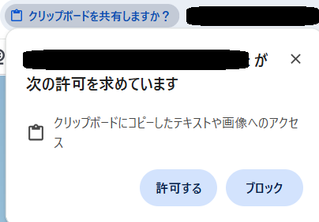

# Kiro IDE 基本操作ハンズオン: Kiro の機能を体験しよう 🛠️

## 概要

Kiro IDE の基本的な機能を一通り体験するハンズオンです。チャットインターフェースの操作、コンテキストプロバイダー、エージェントフック、スキル、MCP サーバーといった Kiro の主要機能を、簡単な操作を通じて学びます。

**所要時間**: 約20〜30分

**前提条件**:
- Kiro がインストール済みであること
- Python がインストール済みであること
- 基本的な Kiro の画面操作（チャット欄への入力）ができること

---

## DCV のリモートデスクトップへのコピー操作について

* ブラウザでクリップボード共有が求められた場合は、許可して下さい。

    

* ブラウザによってはローカルからの直接コピーができない場合があります。
    - その場合は、左上にあるクリックボードアイコンをクリックして、「**Copy and paste**」ダイアログ経由でコピーして下さい。

    

---

## ハンズオン手順

---

### ステップ 0: ワークスペースの準備

1. デスクトップに空のフォルダを作成します（例: `kiro-basic`）
    - デスクトップをクリック、右クリックから新しいフォルダ作成を指定します。
1. デスクトップの Kiro のアイコンをクリックして Kiro を起動します
    - **注意**: アイコンに x がついている場合は、右クリックして「**起動を許可する**」をクリックしてから再度起動して下さい。
1. サインインを行います。
    - 「**Sign in**」をクリックした後、ブラウザが自動で起動するまで待ちます。
1. サインイン方法として **Builder ID** を選択してサインインを進めます
1. サインイン処理の最後で「**アクセスを許可 (Allow access)**」をクリックします。
1. Kiro に戻りセットアップ処理を続けます。
1. 「**Set up shell**」が表示された場合は「**Done**」をクリックします。
1. 「**Do you trust the authors of the files in this folder?**」のダイアログでチェックボックスをチェックして「**Yes, ...**」をクリックします
1. Kiro のメニューで、「**File**」-「**Open Folder...**」で作成したフォルダを選択して開きます

---

### ステップ 1: ステアリングの設定

ステアリングとは、Kiro に対して「プロジェクト全体で守ってほしいルール」を事前に伝える仕組みです。今回は「日本語で応答・コメントする」というルールを設定します。

* Kiro のチャット入力エリアの下に、「**Default**」と表示されていることを確認します。
  - これがいわゆる「**Vibe セッション**」です。Kiro の version 1.0 ではここから Vibe セッションや Spec セッションを選択します。 
  - 「**Let's build**」で「**Vibe**」か 「**Spec**」か選択できる場合、「**Vibe**」を選択します。(Kiro version 0.x )

* チャット欄に以下を入力します:
   - 確認が求められた場合は「**Allow**」または「**Accept**」を選択します。

```
グローバルのステアリングとして messages-in-japanese.md というファイルを作成して、以下の内容を書いてください:

---

inclusion: always

description: 日本語での応答・ドキュメント作成・コードコメント記述に関するルール

---

# 日本語プロジェクト開発ガイドライン

## 言語使用規則

### ユーザーコミュニケーション

- 日本語で質問された場合は必ず日本語で回答する

- 技術的な説明も日本語で行い、必要に応じて英語の技術用語を併記する

- エラーメッセージや警告は日本語で表示する

### ドキュメント作成

- 仕様書・設計書は日本語で記述する

- README、API ドキュメントは日本語を優先する

- コードコメントは日本語で記述する

- 変更履歴やコミットメッセージは日本語で記述する

- 仕様駆動開発の requirements.md における EARS 記法（Easy Approach to Requirements Syntax）では、WHEN・SHALL・IF・THEN・WHILE・WHERE などのキーワードは英語のまま使用し、それ以外の要件内容は日本語で記述する

### コード規約

- 変数・関数・クラス名: 英語を使用（国際的な標準に準拠）

- コメント: 日本語で記述し、コードの意図を明確に説明する

- 外部ライブラリ・API: 英語名をそのまま使用する

- 定数・設定値: 英語名を使用し、コメントで日本語説明を追加する

### 技術用語の扱い

- 一般的な技術用語は英語のまま使用（例：API、JSON、HTTP）

- 日本語訳が不自然な場合は英語を優先し、必要に応じて日本語説明を併記する

### ログ・デバッグ出力

- ユーザー向けメッセージ: 日本語必須

- エラーハンドリング: ユーザーに表示されるメッセージは日本語で記述する

```

Kiro の左側で Kiro のアイコンをクリックして、「AGENT STEERING & SKILLS」の「Global」の下に `messages-in-japanese.md` が存在することを確認します。

> 💡 **ポイント**: これ以降、Kiro は日本語でコメントを書き、日本語で応答してくれるようになります。ステアリングはプロジェクト単位で設定でき、チーム全員で共有できます。

---

### ステップ 2: チャットインターフェースの基本操作

Kiro のチャット機能の基本的な使い方を体験します。

---

#### 2-1. Autopilot モードの確認

1. Kiro のチャットパネルを確認します
2. チャット入力欄の下部に実行モード表示があることを確認します
3. 「**Autopilot**」モードのトグルが有効化されていることを確認します
   - もしトグルが無効化（「Supervised」モード）の場合は、トグルを有効化して「**Autopilot**」に切り替えます

> 💡 **ポイント**: Autopilot モードでは、Kiro が自律的にタスクを完了まで進めます。Supervised モードでは、ファイル変更ごとにユーザーの承認が求められます。

---

#### 2-2. モデルの確認と選択

1. チャット入力欄の下部にあるモデル名（例: 「Auto」）をクリックします
2. 利用可能なモデルのリストが表示されることを確認します
   - Auto 以外に、Claude Sonnet や他のモデルが選択可能なことを確認します
3. リストから「**Auto**」を選択します（既に選択されている場合はそのままで OK）

> 💡 **ポイント**: 「Auto」を選択すると、タスクの内容に応じて最適なモデルが自動的に選ばれます。特定のモデルを指定したい場合は、リストから直接選択できます。

---

#### 2-3. Python コードの手動作成

1. Kiro の左側にある「エクスプローラー」アイコンをクリックします
2. ワークスペース内で右クリック →「**New File**」を選択します
3. ファイル名を `hello.py` として作成します
4. 以下のコードを**手動で**入力します:

```python
print("Hello, World!")
```

5. `Ctrl + S` で保存します

---

#### 2-4. Kiro のチャットでコードの修正を依頼する

1. チャット欄に以下を入力して送信します:

```
hello.py を修正して、ユーザーに名前を入力してもらい、「こんにちは、○○さん！」と表示するようにしてください。
```

2. Kiro がコードを修正するのを確認します
3. 修正後の `hello.py` の内容を確認します

---

#### 2-5. さらに修正を依頼する

1. チャット欄に以下を入力して送信します:

```
hello.py をさらに修正して、現在の日時も一緒に表示するようにしてください。
```

2. Kiro が追加の修正を行うのを確認します

---

#### 2-6. diff の確認

1. Kiro のチャットの応答に表示されている、 「**View changes**」 をクリックします
2. 変更前と変更後のコードが並べて表示されることを確認します
3. 何が追加・変更されたかを確認します
4. diff の表示を閉じます

> 💡 **ポイント**: diff 表示を使うと、Kiro が行った変更を一目で把握できます。意図しない変更がないかチェックするのに便利です。

---

#### 2-7. Revert で修正を取り消す

1. Kiro のチャットの応答にある「**Revert changes**」（または変更を元に戻すオプション）をクリックします
2. 直前の修正が取り消されることを確認します
3. `hello.py` が1つ前の状態に戻っていることを確認します

> 💡 **ポイント**: Revert を使えば、Kiro の変更を簡単に元に戻せます。気に入らない変更や誤った修正をすぐにやり直せるので、安心して試行錯誤できます。

---

#### 2-8. チェックポイントでロールバックする

1. Kiro のチャットパネルで、過去のやり取り（ターン）を確認します
2. 最初に hello.py の修正を行ったプロンプトの右上にある **Restore** をクリックします
3. 確認ダイアログが表示されたら承認します
4. ファイルがそのチェックポイント時点の状態に戻ることを確認します

> 💡 **ポイント**: チェックポイントは Kiro の各ターンごとに自動作成されます。どの時点の状態にも戻れるので、大きな変更を試す前のセーフティネットとして機能します。Revert が直前の変更のみ取り消すのに対し、チェックポイントは任意の過去の状態まで戻れます。

---

#### 2-9. 新しいセッションの作成を試す

1. チャットパネルの上部にある「**+**」アイコン（新しいセッション）をクリックします
2. 新しい空のチャットセッションが開くことを確認します
3. これまでの会話履歴が表示されていないことを確認します

> ⚠️ **重要**: 新しいセッションを作成すると、それまでの会話履歴は新しいセッションには引き継がれません。Kiro は過去のやり取りの文脈を持たない状態で応答します。つまり「さっき作った hello.py を修正して」のような、前のセッションの文脈に依存する指示は通じなくなります。

> 💡 **ポイント**: セッションを分けることで、異なるタスクや話題を整理できます。ただし、会話の文脈がリセットされることを意識して使い分けましょう。長い作業を続ける場合は同じセッション内で進めるのが効率的です。

4. **今回のハンズオンでは、引き続きこのセッションを使用します。** 左側のセッション一覧から、先ほどまで使っていたセッションをクリックして元のセッションに戻ってください。

---

### ステップ 3: コンテキストプロバイダーの使用

Kiro のコンテキストプロバイダー機能を使って、ターミナルのエラー情報を共有する方法を体験します。

---

#### 3-1. 間違った Python コードを作成する

1. `hello.py` を開き、内容を以下のように**手動で**書き換えます:

```python
# わざとエラーを含むコード
name = input("名前を入力してください: ")
print("こんにちは、" + name + "さん！ 今日は" + 2026 + "年です。")
```

2. `Ctrl + S` で保存します

> 💡 **ポイント**: このコードには意図的なバグがあります（文字列と整数の結合エラー）。

---

#### 3-2. ターミナルでエラーを発生させる

1. Kiro のターミナルを開きます
    - 「**View**」-「**Terminal**」または「**Terminal**」-「**New Terminal**」 
2. 以下のコマンドを実行します:

```
python hello.py
```

3. 名前を入力した後、`TypeError` が表示されることを確認します

---

#### 3-3. コンテキストプロバイダーでエラーを修正する

1. Kiro のチャット入力欄で `#` をタイプします
2. 表示されるメニューから「**Terminal**」を選択します
3. ターミナルのエラー内容が参照として追加されます
4. 以下のメッセージを送信します:

```
このエラーを修正してください。
```

5. Kiro がターミナルのエラー内容を読み取り、コードを修正するのを確認します
6. 修正後、ターミナルで再度 `python hello.py` を実行して正常動作を確認します

> 💡 **ポイント**: `#` を使ったコンテキストプロバイダーにより、ファイルやターミナルの内容を Kiro に直接共有できます。エラーメッセージをコピー＆ペーストする手間が省けます。他にも `#File`、`#Folder`、`#Git Diff` などが利用できます。

---

### ステップ 4: エージェントフックの設定と確認

エージェントフックを使って、特定のイベント発生時に自動で処理を実行する方法を体験します。

> ⚠️ **注意**: フックは **Kiro（エージェント）がファイルを操作したとき**に発火します。ユーザーがエディタで手動保存しても発火しません。

---

#### 4-1. フックの設定

ここでは、Kiro が Python ファイルを作成・保存したときに、ログファイルに記録を残すフックを設定します。ファイルに書き出すことで、フックが実際に発火したことを目で確認できます。

1. チャット欄に以下を入力して送信します:

```
エージェントフックを作成してください。

内容:
- 名前: Python ファイル変更ログ
- トリガー: PostFileSave（ファイル保存後）
- マッチャー: .py ファイルのみ対象
- アクション: コマンドで、現在日時を hook-log.txt に追記する（PowerShell の Add-Content を使用）

コマンド例: powershell -Command "Add-Content -Path 'hook-log.txt' -Value ('Python file saved at ' + (Get-Date -Format 'yyyy-MM-dd HH:mm:ss'))"
```

2. Kiro がフックファイル（`.kiro/hooks/` 配下）を作成するのを確認します
3. Kiro の左側で Kiro のアイコンをクリックし、「**AGENT HOOKS**」セクションにフックが表示されることを確認します

> 💡 **ポイント**: フックは `.kiro/hooks/` フォルダに JSON ファイルとして保存されます。トリガー（いつ実行するか）とアクション（何を実行するか）を定義します。

---

#### 4-2. フックの動作確認

フックはエージェント（Kiro）がファイルを操作したときに発火するため、Kiro にファイルの修正を依頼して動作を確認します。

1. チャット欄に以下を入力して送信します:

```
hello.py にコメントを1行追加してください。内容は「# フックのテスト」としてください。
```

2. Kiro が `hello.py` を修正するのを確認します
3. エクスプローラーでワークスペース内に `hook-log.txt` が作成されていることを確認します
4. `hook-log.txt` を開き、フックが実行された日時のログが記録されていることを確認します

> 💡 **ポイント**: フックは Kiro（エージェント）のファイル操作をトリガーに実行されます。今回はログファイルへの記録で発火を確認しましたが、実際の開発ではリント実行やテスト実行の自動化に活用できます。ユーザーの手動保存では発火しない点に注意してください。

---

### ステップ 5: スキルの設定と確認

スキルを使って、Kiro に特定の作業パターンを教え、再利用可能な手順として呼び出す方法を体験します。

---

#### 5-1. スキルの設定

ここでは、Python ファイルのドキュメント文字列（docstring）を生成するスキルを作成します。

> 💡 **スキルとステアリングの違い**: ステアリングはプロジェクトのルール・規約を定義する単一の Markdown ファイルです。スキルは再利用可能なワークフロー（手順）を定義するもので、フォルダ単位で管理し、[agentskills.io](https://agentskills.io) のオープン標準に準拠しています。

スキルのフォルダ構成:
```
.kiro/skills/
└── python-docstring/      ← スキル名のフォルダ
    └── SKILL.md           ← スキル定義ファイル（必須）
```

1. チャット欄に以下を入力して送信します:

````
以下の内容でスキルを作成してください。

フォルダとファイル: .kiro/skills/python-docstring/SKILL.md
内容:

---
name: python-docstring
description: Python の関数やクラスに Google スタイルの日本語 docstring を自動生成する。docstring の追加やドキュメント整備を依頼されたときに使用。
---

## 手順

1. 指定された Python ファイルを読み込む
2. docstring が未記載の関数・クラスを特定する
3. 各関数・クラスに以下の形式で docstring を追加する

## docstring のフォーマット

Google スタイルで、日本語で記述する:

```python
def calculate_total(price: int, tax_rate: float) -> float:
    """合計金額を計算する。

    税率を適用して最終的な合計金額を算出します。

    Args:
        price: 商品の価格（税抜き）
        tax_rate: 税率（例: 0.1 は10%）

    Returns:
        税込みの合計金額

    Raises:
        ValueError: price が負の値の場合
    """
```


## ルール

- docstring は日本語で記述する
- 既に docstring がある関数は上書きしない
- 型ヒントがある場合はそれを参考にする
- Args、Returns、Raises の各セクションは該当する場合のみ記載する
````

2. Kiro がスキルフォルダとファイルを作成するのを確認します
3. Kiro の左側で Kiro のアイコンをクリックし、「**AGENT STEERING & SKILLS**」セクションで `python-docstring` スキルが表示されることを確認します

> 💡 **ポイント**: スキルは `name` と `description` をフロントマターに定義します。`description` の内容をもとに、Kiro がユーザーのリクエストに合致するスキルを自動的にマッチングして呼び出します。また、チャットで `/python-docstring` と入力して明示的に呼び出すこともできます。

---

#### 5-2. スキルの動作確認

1. まず、docstring がない Python ファイルを作成します。チャット欄に以下を入力します:

```
以下の内容で calculator.py を作成してください（docstring は付けないでください）:

def add(a: int, b: int) -> int:
    return a + b

def subtract(a: int, b: int) -> int:
    return a - b

def multiply(a: int, b: int) -> int:
    return a * b

def divide(a: int, b: int) -> float:
    if b == 0:
        raise ZeroDivisionError("0で割ることはできません")
    return a / b
```

2. `calculator.py` が作成されたことを確認します

3. チャット欄に以下を入力して送信し、スキルを呼び出します:

```
calculator.py の全ての関数に docstring を追加してください。
```

   - Kiro が `python-docstring` スキルの `description` にマッチし、スキルが自動的にアクティベートされます
   - または、明示的に `/python-docstring` と入力して呼び出すこともできます

4. Kiro がスキルの手順に従い、各関数に日本語の docstring を追加するのを確認します
5. `calculator.py` を開き、Google スタイルの docstring が追加されていることを確認します

> 💡 **ポイント**: スキルは agentskills.io のオープン標準に準拠しているため、チーム内での共有はもちろん、他の AI ツールとの互換性もあります。再利用可能なワークフローをスキルとして定義し、チーム全員で同じ品質の作業を実行できます。

---

## 次のハンズオン

お疲れさまでした！
ステップ 6　はスキップして、次は Vibe コーディングでアプリケーションを作成するハンズオンに挑戦してみましょう。

→ [Vibe コーディング](../vibe/README.md)


---

### （オプション）ステップ 6: MCP サーバーの設定と使用

MCP（Model Context Protocol）サーバーを設定し、Kiro に外部ツールを連携させる方法を体験します。

> ⚠️ **注意**: この手順は Node.js / npx がインストールされている環境でのみ実施できます。環境によっては MCP サーバーが利用できない場合がありますので、その場合はスキップしてください。

---

#### 6-1. MCP サーバーの設定

ここでは、シンプルでわかりやすい「時刻取得」の MCP サーバーを設定します。

1. Kiro のチャット欄に以下を入力して送信します:

```
ワークスペースの MCP 設定ファイル（.kiro/settings/mcp.json）を作成して、以下の MCP サーバーを追加してください:

{
  "mcpServers": {
    "time": {
      "command": "npx",
      "args": ["-y", "@modelcontextprotocol/server-time"]
    }
  }
}
```

2. Kiro が設定ファイルを作成するのを確認します
3. Kiro の左側で Kiro のアイコンをクリックし、「**MCP SERVERS**」セクションで `time` サーバーが表示され、接続状態（緑のアイコン）になることを確認します
   - もし接続されない場合は、サーバー名の横にある再接続アイコンをクリックします

> 💡 **ポイント**: MCP サーバーは `.kiro/settings/mcp.json` に設定します。`npx` コマンドで npm パッケージとして配布されている MCP サーバーを簡単に起動できます。

---

#### 6-2. MCP サーバーの動作確認

1. チャット欄に以下を入力して送信します:

```
現在の東京の時刻を教えてください。
```

2. Kiro が MCP サーバー（time ツール）を使用して時刻情報を取得するのを確認します
   - ツールの使用許可を求められたら「**Allow**」または「**Accept**」をクリックします
3. 東京のタイムゾーン（Asia/Tokyo）の現在時刻が表示されることを確認します

> 💡 **ポイント**: MCP により、Kiro は外部ツールやサービスと連携できます。AWS ドキュメント検索、データベース操作、API テストなど、様々な MCP サーバーが公開されています。

---

## 振り返り

このハンズオンで体験した Kiro の機能をまとめます:

| 機能 | 体験した内容 | 活用シーン |
|------|------|------|
| ステアリング | 日本語ルールの設定 | プロジェクトルールの共有 |
| チャットインターフェース | コード修正、diff確認、Revert、チェックポイント | 日常的なコーディング |
| コンテキストプロバイダー | ターミナルエラーの共有と修正 | デバッグ・トラブルシューティング |
| エージェントフック | ファイル保存時の自動構文チェック | CI/CD・品質管理の自動化 |
| スキル | docstring の自動生成 | チーム標準の作業パターン共有 |
| MCP サーバー（オプション） | 外部ツール（時刻取得）との連携 | 外部サービス・ツール連携 |

---

## FAQ

| 質問 | 回答 |
|------|------|
| Autopilot と Supervised はどう使い分ける？ | 信頼できる定型作業は Autopilot、慎重に確認したい変更は Supervised が適しています |
| MCP サーバーは自作できる？ | はい。MCP の仕様に準拠したサーバーを作成すれば、独自のツールを Kiro に連携できます |
| フックとスキルの違いは？ | フックはイベント駆動で自動実行されます。スキルはユーザーが明示的に呼び出すテンプレートです |
| スキルはチーム共有できる？ | はい。`.kiro/skills/` フォルダごと Git で管理すればチーム全員で共有できます |

---

## トラブルシューティング

| 症状 | 対処 |
|------|------|
| MCP サーバーが接続されない | Node.js / npx がインストールされているか確認。ターミナルで `npx --version` を実行 |
| フックが動作しない | `.kiro/hooks/` 内の JSON ファイルの構文を確認。Kiro を再起動してみる |
| スキルが表示されない | `.kiro/skills/` 内のファイルパスとフロントマターの `inclusion` 設定を確認 |
| Python が実行できない | ターミナルで `python --version` を実行し、Python がインストールされているか確認 |
| `#` でコンテキストメニューが出ない | チャット入力欄にフォーカスがあることを確認。`#` の後にスペースを入れずに続けて入力 |
